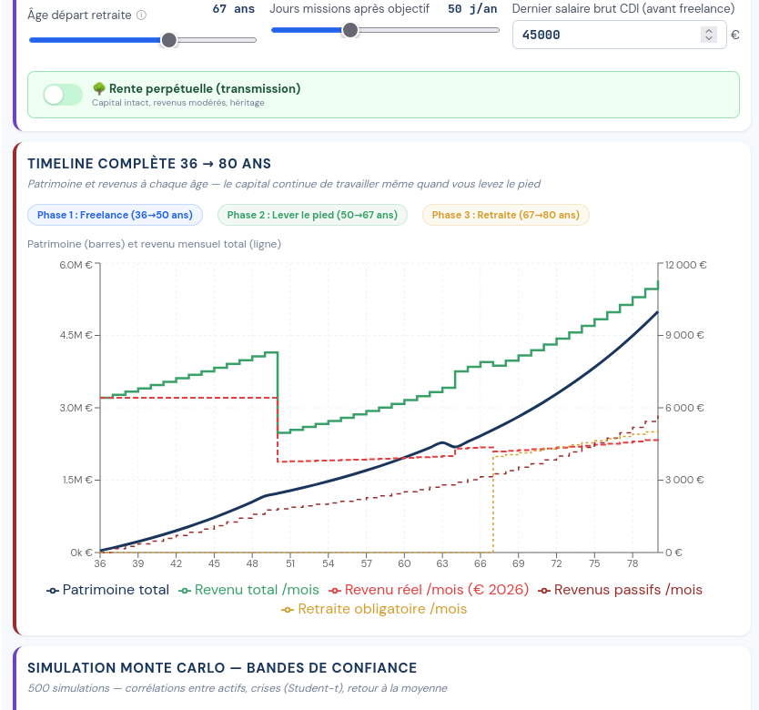

# Simulateur Freelance SASU vs EURL

Simulateur de projection patrimoniale pour freelances en SASU ou EURL. Calcule charges, dividendes, IR, retraite et projette votre patrimoine sur 30+ ans avec simulations Monte Carlo.

**[Lancer le simulateur](https://allan-simon.github.io/freelance-simulator/)**



## Pourquoi ce simulateur ?

La plupart des comparateurs SASU/EURL s'arrêtent au net annuel. Celui-ci va plus loin :

- **Projection patrimoniale complète** :contrat capi, SCPI, PEA, PER, avec fiscalité de sortie par enveloppe
- **Retraite réaliste** :trimestres, SAM, AGIRC-ARRCO, décote/surcote, âge de départ variable
- **Phases de vie** :freelance full-time, lever le pied, retraite, avec transition modélisée
- **Monte Carlo** :500 simulations avec corrélations inter-actifs et queues épaisses (Student-t), pas juste un rendement moyen
- **ARE créateur** :plafond 60% des droits (réforme avril 2025), capitalisation boost pendant la phase chômage
- **Inflation** :tous les montants affichés en euros constants, pas de fausse impression de richesse

## Ce que le simulateur ne fait PAS

- Pas de calcul "de tête" : chaque taux est sourcé dans [`skills/sasu/reglementation-2026.md`](skills/sasu/reglementation-2026.md)
- Pas de conseil fiscal :c'est un outil d'exploration, votre expert-comptable valide

## Utilisation avec une IA

Le simulateur est conçu "AI-first". Le moteur de calcul (`src/model.js`) est déterministe et documenté, ce qui permet à une IA de raisonner dessus sans halluciner les chiffres.

**Dans le simulateur** : cliquez sur "Comment utiliser avec ChatGPT / Claude" pour copier le prompt système.

**Dans Claude Code** : le skill `/sasu` donne accès au simulateur en CLI :

```bash
# Rapport complet
node cli.js --step4 --tjm 1200 --jours 220 --salaireBrut 60000 --per 5000 --divNetsVoulus 40000

# Comparaison SASU vs EURL
node cli.js --step4 --forme sasu [params]
node cli.js --step4 --forme eurl [params]
```

Les skills sont dans [`skills/sasu/`](skills/sasu/) :
- [`SKILL.md`](skills/sasu/SKILL.md) :instructions pour l'agent IA
- [`reglementation-2026.md`](skills/sasu/reglementation-2026.md) :tous les taux et seuils sourcés
- [`guide-optimisation.md`](skills/sasu/guide-optimisation.md) :stratégies d'optimisation

## Paramètres configurables

| Paramètre | Défaut | Description |
|---|---|---|
| `tjm` | 1 200 | Taux journalier moyen |
| `jours` | 220 | Jours facturés par an |
| `salaireBrut` | 60 000 | Salaire brut annuel (SASU) |
| `divNetsVoulus` | 40 000 | Dividendes nets visés |
| `per` | 5 000 | Versement PER annuel |
| `ageObjectif` | 50 | Âge pour lever le pied |
| `ageRetraite` | 67 | Âge de départ à la retraite |
| `forme` | sasu | `sasu` ou `eurl` |
| `inflation` | 2% | Inflation annuelle |

Tous les paramètres sont passables en query string : `?tjm=1500&jours=200&forme=eurl`

## Stack technique

- React + Vite, single-page, zéro backend
- Recharts pour les graphiques
- Hébergé sur GitHub Pages

## Licence

**Source available, pas open source.** Vous pouvez étudier le code pour comprendre les calculs et identifier d'éventuelles erreurs. Toute oeuvre dérivée est interdite sans autorisation. Voir [LICENSE](LICENSE).

Contact : allan.simon.pro@outlook.com
